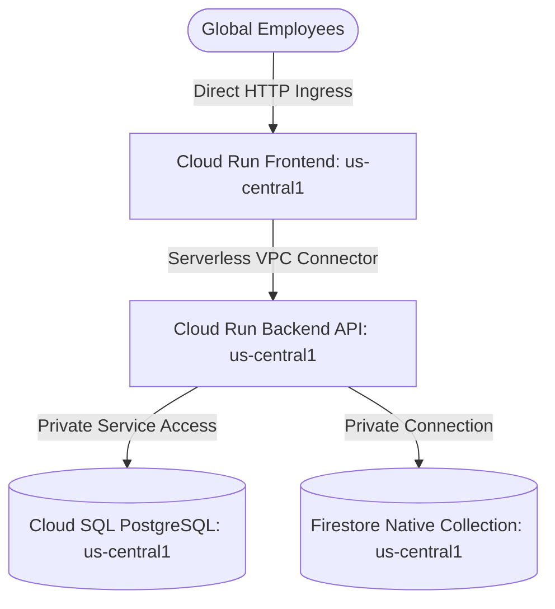

# Lab 1: Modernizing GCP Workloads via Agentic Tools (Module 1 - Phase 1)

Welcome to **Lab 1: Learning Lab** of Module 1. In this hands-on lab, you act as a Lead Platform & Cloud Solutions Engineer consulting for **Cymbal Group's Enterprise Architecture Division**. You will analyze, document, modernize, and deploy a highly available, multi-region architecture for the **Cymbal HR Vacation Request Subsystem** using Agentic AI tools, Google Agent Skills, Terraform, and the Model Context Protocol (MCP).

> ⚠️ **CRITICAL LAB DISCIPLINE & RESTRICTION**: You are operating in a production governance scenario. **Direct manual web interaction with the Google Cloud Console (`console.cloud.google.com`) is strictly prohibited.** You MUST use Agentic AI tools (VS Code Antigravity Extension, Antigravity CLI, Google Agent Skills, and `gcloud` via terminal/MCP) for all infrastructure discovery, code updates, declarative IaC execution, imperative CLI tool calls, and health verifications.

---

## 🎯 Learning Objectives

By completing this lab, you will learn how to:
1. **Choose the Best Tool for the Right Task**: Seamlessly navigate between the VS Code Antigravity Plugin, Antigravity CLI, Antigravity 2.0, and `gcloud` MCP tools.
2. **Master Agentic Context Engineering**: Understand why creating README files, architecture diagrams, and system documentation is essential for grounded agent reasoning.
3. **Discover & Document Brownfield Workloads**: Use Agentic AI tools to analyze an existing single-region Google Cloud application and generate logical architecture diagrams and summary reports.
4. **Analyze Customer Requirements & Meeting Transcripts**: Synthesize business feedback, latency requirements, and regional failure risks into actionable technical directives.
5. **Declarative Infrastructure Modernization**: Generate and apply Terraform code updates to provision foundational networks, Cloud SQL, Firestore, and Memorystore for Redis in the primary region.
6. **Imperative Multi-Region Expansion**: Deploy secondary-region compute (`europe-west1`) and cross-region Cloud SQL read replicas imperatively using `gcloud` CLI tool calls and MCP services.
7. **Evaluate Declarative vs. Imperative Methodologies**: Compare declarative IaC against imperative tool-calling deployment workflows in multi-region environments.
8. **Verify System Resiliency & Failover**: Test multi-region Anycast routing via a Global External Application Load Balancer with Serverless NEGs and validate health checks under simulated regional failure.

---

## 👥 Intended Learner Profile

* **Target Audience**: Practice CEs, Platform CEs (incl. Partner Advisors), Outcome CEs, and GCC Engineers.
* **Lab Format**: **Learning Lab (Build)** — Guided scenario-driven analysis, refactoring, and step-by-step multi-region cloud engineering.

---

## 🏢 Business Scenario: Infrastructure Modernization for Cymbal Group

Cymbal Group relies on a critical internal HR portal—specifically the **Vacation Request Subsystem**—to handle time-off scheduling and accrued balance logic for international subsidiaries across retail, healthcare, and financial service sectors. 

Currently, this system operates as a single-region brownfield deployment in `us-central1`. During peak quarterly review cycles, localized regional latency spikes heavily degrade performance for European and Asian subsidiaries. A recent minor outage in the host region completely locked out over 15,000 employees.

Recognizing the operational risk, Cymbal Group's Enterprise Architecture team has compiled a strict set of technical directives and migration requirements. Your objective is to execute your customer's design, migrating the application from its vulnerable single-region footprint into a highly available, globally distributed, multi-region architecture.

### Problem Identification
The customer's legacy HR solution has three major structural limitations:
1. **Regional Blocker**: The Cloud Run frontend, backend, primary Cloud SQL PostgreSQL instance, and Firestore database reside entirely in a single Google Cloud region (`us-central1`). A regional failure causes total loss of application availability.
2. **Database Scalability Bottlenecks**: The single-region database forces global corporate traffic to route to `us-central1` for all transactional reads, causing unacceptable >800ms latency for remote subsidiaries.
3. **Coupled Traffic Routing**: The legacy architecture routes traffic directly to the regional Cloud Run URL, lacking global load balancing, Anycast IP routing, or automatic regional failover capabilities.

---

## 📋 High-Level Task Overview

```
+-----------------------------------------------------------------------------------+
| TASK 1: Workload Discovery & Baseline Architecture Documentation (Agentic Discovery)|
+-----------------------------------------------------------------------------------+
                                         │
                                         ▼
+-----------------------------------------------------------------------------------+
| TASK 2: Analyze Customer Requirements & Generate Resiliency Enhancements         |
+-----------------------------------------------------------------------------------+
                                         │
                                         ▼
+-----------------------------------------------------------------------------------+
| TASK 3: Modernize Core Infrastructure via Declarative Terraform (Region 1 / Shared)|
+-----------------------------------------------------------------------------------+
                                         │
                                         ▼
+-----------------------------------------------------------------------------------+
| TASK 4: Imperative Multi-Region Expansion & Compute Decoupling (Region 2 / GCLB)  |
+-----------------------------------------------------------------------------------+
                                         │
                                         ▼
+-----------------------------------------------------------------------------------+
| TASK 5: Multi-Region Resilience Verification, Health Checks & Failover Testing    |
+-----------------------------------------------------------------------------------+
```

---

## 🛠️ Detailed Lab Execution Steps

---

### Task 1: Workload Discovery & Baseline Architecture Documentation

In this task, you use Agentic AI IDE features and MCP tools to inspect the brownfield codebase (`Lab1/ce-sample-hr-vacation` cloned from `https://github.com/alanpoole/ce-sample-hr-vacation`) and generate baseline topology documentation.

#### Step 1.1: Analyze the Existing Workload Codebase
Prompt your Agentic AI IDE (or Antigravity CLI) to analyze the project:
```text
Inspect the application codebase and infrastructure templates under Lab1/ce-sample-hr-vacation. 
Identify all active Google Cloud services, networking boundaries, database connections, and ingress routing rules.
```

#### Step 1.2: Generate Baseline Summary Document & Architecture Diagram
Instruct the Agentic AI tool to generate two output artifacts in your workspace:
1. `docs/baseline_summary.md`: A high-level description of all Google Cloud components, service dependencies, and single-region vulnerability risks.
2. `docs/baseline_architecture.mermaid`: A standard Mermaid sequence/flow diagram illustrating the baseline topology.

Example Mermaid snippet for baseline architecture:


We will share what good looks like

---

### Task 2: Analyze Customer Requirements & Call Transcripts

Review feedback from the previous customer alignment meeting to determine technical gaps and produce an updated architecture blueprint.

#### Step 2.1: Ingest Customer Transcripts & Directives
Open and examine [customer_requirements.md](file:///Users/ashwinikm/Desktop/Project_Elevate/projectelevate-module1/Lab1/docs/customer_requirements.md).

Prompt your Agentic AI tool:
```text
Analyze docs/customer_requirements.md and summarize Cymbal Group's key latency, availability, caching, and multi-region routing mandates into a structured enhancement list.
```

#### Step 2.2: Generate Updated Architecture Artifacts
Instruct the agent to update your documentation to reflect the proposed target multi-region architecture:
1. `docs/updated_summary.md`: Outlining the technical specification for cross-region Cloud SQL replication, multi-region Firestore, Memorystore for Redis caching, and GCLB Anycast routing.
2. `docs/updated_architecture.mermaid`: Target state architecture diagram showing symmetric dual-region Cloud Run services and cross-region database flows.

> 🤖 **Automated Scoring Check 2**: The lab validator captures `updated_summary.md` and `updated_architecture.mermaid`. An LLM Judge verifies an **80%+ alignment** with customer requirements.

### Coursework: Upgrading to Multi-Region Load Balancing

To support low-latency global transactions for subsidiaries in Europe and Asia, students must upgrade the baseline single-region configuration into a highly available, multi-regional topology.

Follow these step-by-step instructions to update your application code and IaC templates to be multi-regional:

#### Step 1: Declare a Second Regional Cloud Run App Service
In `terraform/main.tf`, declare a new regional Cloud Run app service in a second region (e.g., `europe-west1`):

```hcl
resource "google_cloud_run_v2_service" "app_europe" {
  name     = "hr-vacation-app-europe"
  location = "europe-west1"
  ingress  = "INGRESS_TRAFFIC_INTERNAL_LOAD_BALANCER"

  template {
    containers {
      image = "${var.region}-docker.pkg.dev/${var.project_id}/${google_artifact_registry_repository.app_repo.repository_id}/app:latest"
      ports {
        container_port = 8080
      }
      env {
        name  = "DB_WRITE_HOST"
        value = "write-db.hr-vacation.internal"
      }
      env {
        name  = "DB_READ_HOST"
        value = "read-db.hr-vacation.internal"
      }
      env {
        name  = "DB_PASS"
        value = random_password.alloydb_password.result
      }
    }
    # Enforce routing outbound traffic through Serverless VPC Connector
    vpc_access {
      connector = google_vpc_access_connector.vpc_connector.id
      egress    = "ALL_TRAFFIC"
    }
  }
}
```

#### Step 2: Create a European Serverless NEG
Define a regional serverless Network Endpoint Group (NEG) targeting the new European Cloud Run app service:

```hcl
resource "google_compute_region_network_endpoint_group" "serverless_neg_europe" {
  name                  = "hr-vacation-neg-europe"
  network_endpoint_type = "SERVERLESS"
  region                = "europe-west1"
  cloud_run {
    service = google_cloud_run_v2_service.app_europe.name
  }
}
```

#### Step 3: Register Both Regional NEGs to the Backend Service
Update the existing backend service (`google_compute_backend_service.backend_service`) to route traffic to both the US and Europe NEGs. GCLB will automatically direct clients to the nearest region using Anycast IP routing:

```hcl
resource "google_compute_backend_service" "backend_service" {
  name                  = "hr-vacation-backend-service"
  protocol              = "HTTP"
  port_name             = "http"
  load_balancing_scheme = "EXTERNAL_MANAGED"

  # Primary US Backend
  backend {
    group = google_compute_region_network_endpoint_group.serverless_neg.id
  }

  # Failover / Latency-Optimized Europe Backend
  backend {
    group = google_compute_region_network_endpoint_group.serverless_neg_europe.id
  }
}
```

#### Step 4: Configure Cross-Region AlloyDB Replication & Private DNS
To ensure highly available relational transactions and seamless regional failovers, configure an AlloyDB Primary cluster in `us-central1` and an asynchronous Secondary replica cluster in `europe-west1` with Continuous Storage-level log streaming. Declare the Secondary cluster and instance in Terraform:

```hcl
# AlloyDB Secondary DR Cluster in europe-west1
resource "google_alloydb_cluster" "secondary" {
  cluster_id   = "hr-vacation-cluster-secondary"
  location     = "europe-west1"
  cluster_type = "SECONDARY"

  network_config {
    network = google_compute_network.vpc_network.id
  }

  secondary_config {
    primary_cluster_name = google_alloydb_cluster.primary.name
  }

  deletion_protection = false
}

# Secondary replica instance in europe-west1
resource "google_alloydb_instance" "secondary_instance" {
  cluster       = google_alloydb_cluster.secondary.name
  instance_id   = "hr-vacation-secondary-instance"
  instance_type = "SECONDARY"

  machine_config {
    cpu_count = 2
  }

  depends_on = [google_alloydb_instance.primary_instance]
}
```

And map private DNS records inside Cloud DNS to provide abstraction endpoints:

```hcl
# Map DB_WRITE_HOST: write-db.hr-vacation.internal -> Primary AlloyDB IP
resource "google_dns_record_set" "write_dns" {
  name         = "write-db.hr-vacation.internal."
  managed_zone = google_dns_managed_zone.private_zone.name
  type         = "A"
  ttl          = 60
  rrdatas      = [google_alloydb_instance.primary_instance.ip_address]
}
```

#### Step 5: Verify the Multi-Regional Setup & Failover
1. Apply the updated Terraform configuration (`terraform apply`).
2. Verify that GCLB forwards traffic to both `us-central1` and `europe-west1` based on user location.
3. Access the portal and inspect the simulated terminal logs. Confirm that requests are routed securely to the nearest database node!
4. Practice a simulated disaster recovery failover by promoting the Secondary AlloyDB cluster in `europe-west1` and redirecting Cloud DNS `write-db.hr-vacation.internal.` record to point to the promoted instance without redeploying the backend.
5. Run automated verification suite (`bash verify.sh`).

> 🤖 **Automated Scoring Check 3**: Background Agentic AI tools inspect your live Google Cloud environment, generate a final environment summary document, and run an LLM Judge comparison against reference materials to calculate your final score.

---

## 📊 Summary Rubric & Validation Matrix

| Scoring Criterion | Threshold / Standard | Weight |
|---|---|---|
| **Zero Manual Console Access** | 100% actions logged via Agentic IDE / CLI / MCP (`console.cloud.google.com` unused) | Required Pass |
| **Baseline Architecture Document** | `baseline_summary.md` and `baseline_architecture.mermaid` uploaded (LLM Judge match ≥80%) | 20 Points |
| **Customer Requirements Analysis** | `updated_summary.md` and `updated_architecture.mermaid` uploaded (LLM Judge match ≥80%) | 20 Points |
| **Declarative Primary Region Modernization** | Terraform applied for VPC, Cloud SQL Master, Firestore, Redis in `us-central1` | 20 Points |
| **Imperative Secondary Expansion** | Cloud Run, Cross-Region Read Replica & GCLB NEGs deployed via `gcloud`/MCP in `europe-west1` | 20 Points |
| **Resiliency & Failover Verification** | `verify.sh` passes health checks and regional failover test with <50ms read latency | 20 Points |

---
*End of Lab 1 Student Lab Guide.*
