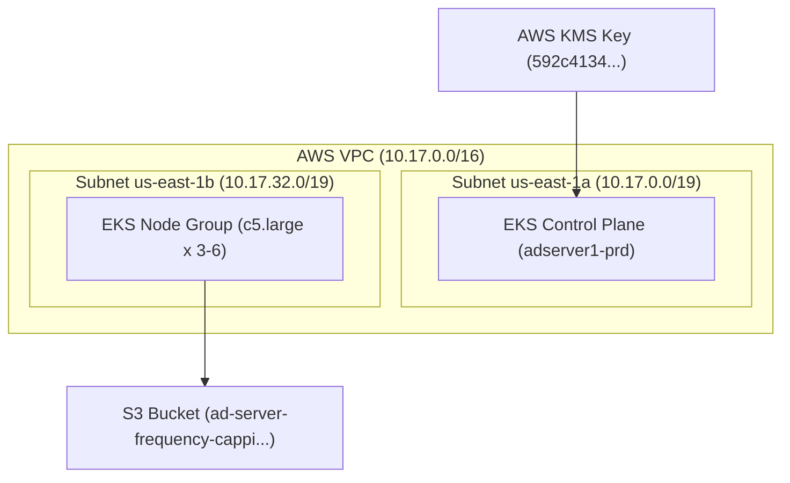
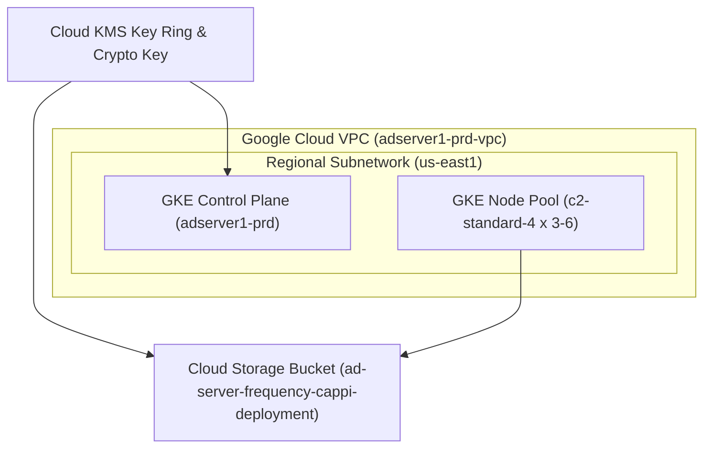

# AWS to GCP Migration Analysis & Proposal
**Customer**: Cymbal Group - AdServer Production Migration Team  
**Lab Code**: 1.4 (Module 1 - Phase 4)  
**Source Infrastructure File**: [aws_environment.json](file:///Users/ashwinikm/Desktop/Project_Elevate/projectelevate-module1/Lab2/data/aws_environment.json)

---

## 1. Overview of Existing AWS Environment

Based on the parsed `aws_environment.json` Terraform state file, the customer currently operates a production Kubernetes infrastructure supporting the **adserver1-prd** application in the `us-east-1` region.

### Discovered AWS Infrastructure Components:
1. **Network Layer**:
   - **VPC**: `vpc-0f66b00d630fa0eae` (`10.17.0.0/16`)
   - **Subnets**: 
     - `subnet-0836817029577d368` (Public AZ `us-east-1a`, CIDR `10.17.0.0/19`)
     - `subnet-0cec9bdb77e81cf37` (Public AZ `us-east-1b`, CIDR `10.17.32.0/19`)
   - **Security Group**: `sg-0deedaa55b108dd70` (`prd-adserver1-prd-k8s-sg`)

2. **Compute & Kubernetes Layer**:
   - **EKS Cluster**: `adserver1-prd` (Kubernetes v1.33, API/Audit/Authenticator logging enabled)
   - **Node Group**: `prd-adserver1-prd-main`
     - **EC2 Instance Type**: `c5.large` (2 vCPU, 4 GiB RAM, Compute Optimized)
     - **Scaling Configuration**: Desired: 3, Min: 1, Max: 6
     - **OS / Storage**: Amazon Linux 2023, 200 GB EBS root volume per node

3. **Security & Governance Layer**:
   - **KMS Key**: Symmetric Key `592c4134-01bd-4ab1-82eb-9c9824529375` (Alias: `alias/eks/adserver1-prd`) used for EKS Secret Encryption.
   - **IAM Roles**: Cluster and Worker Node role policy attachments (`AmazonEKSClusterPolicy`, `AmazonEKSWorkerNodePolicy`, `AmazonEC2ContainerRegistryReadOnly`, `AmazonEKSVPCResourceController`).

4. **Storage Layer**:
   - **S3 Bucket**: `ad-server-frequency-cappi-serverlessdeploymentbuck-ejatrrd0o9w5` with SSL enforcement policy and standard AES256 default encryption.

---

## 2. AWS to GCP Resource Mapping Matrix

| AWS Component | Discovered AWS Resource | Equivalent Google Cloud (GCP) Resource | Recommended GCP Configuration |
| :--- | :--- | :--- | :--- |
| **Virtual Network** | `aws_vpc` (`10.17.0.0/16`) | `google_compute_network` | Custom Mode VPC Network |
| **Subnet A** | `aws_subnet` (`10.17.0.0/19`, `us-east-1a`) | `google_compute_subnetwork` | `10.17.0.0/19` with Secondary Ranges for Pods/Services |
| **Subnet B** | `aws_subnet` (`10.17.32.0/19`, `us-east-1b`) | `google_compute_subnetwork` | `10.17.32.0/19` |
| **Container Engine** | `aws_eks_cluster` (`adserver1-prd`) | `google_container_cluster` | GKE Standard / Autopilot Cluster |
| **Worker Node Group** | `aws_eks_node_group` (`c5.large`, scaling 1-6) | `google_container_node_pool` | Node Pool with `c2-standard-4` or `n2-standard-4` machines |
| **Encryption Keys** | `aws_kms_key` & `aws_kms_alias` | `google_kms_key_ring` & `google_kms_crypto_key` | Cloud KMS Key for Application-Layer Secrets Encryption |
| **Identity & Access** | `aws_iam_role` & IAM Policies | `google_service_account` & IAM Roles | Least-privilege IAM bindings & Workload Identity |
| **Object Storage** | `aws_s3_bucket` & Policy | `google_storage_bucket` | Cloud Storage Bucket with Uniform Bucket-Level Access & Customer-Managed KMS Key |

---

## 3. Logical Architecture Diagrams

### AWS Current State


### GCP Target Architecture


---

## 4. Value Proposition & Key Benefits of Moving to GCP

1. **Native Kubernetes Expertise (GKE)**:
   - Google Kubernetes Engine (GKE) offers four-dimensional auto-scaling (Cluster Autoscaler, Horizontal Pod Autoscaler, Vertical Pod Autoscaler, and Node Auto-Provisioning), providing faster scaling response times than EKS Managed Node Groups.
   - GKE Autopilot can reduce cluster operational overhead to zero while lowering compute costs by billing only for Pod requests rather than unallocated node capacity.

2. **Unified VPC Networking**:
   - Google Cloud VPCs are global resources, enabling multi-region subnet expansion without needing complex VPC peering or Transit Gateways.
   - Native IP-alias integration simplifies pod routing without requiring AWS CNI secondary IP management issues.

3. **Superior Compute Performance for AdTech**:
   - AdServer workloads are latency-sensitive. GCP's Compute-Optimized `C2` family delivers consistently high single-core performance and network bandwidth, optimizing response times for high-frequency ad server operations.

4. **Security & Governance Integration**:
   - GCP Cloud KMS integrates directly into GKE for application-layer secret encryption with automatic key rotation and centralized audit logging via Cloud Audit Logs.

---

## 5. GCP Reference Infrastructure Code

The corresponding GCP Terraform code has been generated and saved to [main.tf](file:///Users/ashwinikm/Desktop/Project_Elevate/projectelevate-module1/Lab2/main.tf).

### Quick Deployment Instructions:
```bash
# Initialize Terraform
terraform init

# Validate configuration
terraform validate

# Provision GCP Resources
terraform plan
terraform apply
```

---

## 6. Migration Center & AI Proposal Generation Workflow

To generate a custom executive-ready business proposal for Cymbal Group leadership:
1. Navigate to the **Migration Center** in the Google Cloud Console.
2. Import `aws_environment.json` using the **Asset Ingestion / Migration Assessment** tool.
3. Leverage the embedded **Gemini AI Business Proposal Generator** to create custom cost analysis reports and TCO (Total Cost of Ownership) comparison slides directly from the assessment findings.
