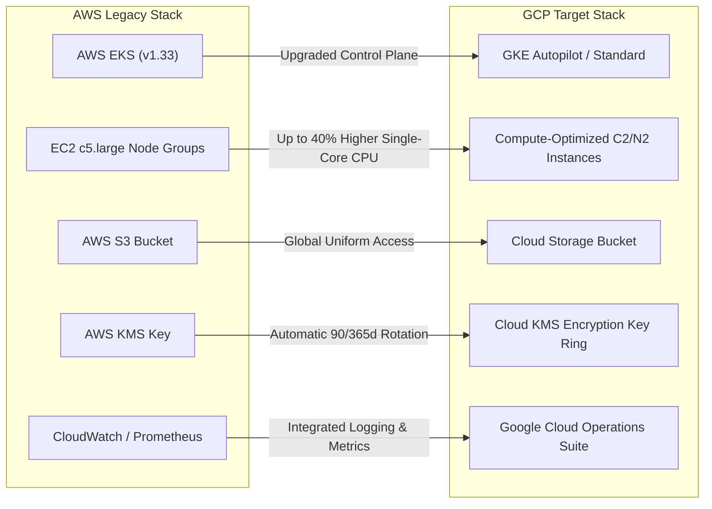

# Executive Value Proposition: Why Google Cloud Platform (GCP) is Superior for Cymbal AdServer Migration

**Prepared for**: Cymbal Group - AdServer Production Engineering Leadership  
**Target Environment**: Google Cloud Platform (`alpha-code-461805`)  
**Source Baseline**: AWS EKS Environment (`adserver1-prd`)

---

## Executive Summary

Migrating the **adserver1-prd** application from Amazon Web Services (AWS) to Google Cloud Platform (GCP) transitions Cymbal Group from legacy container hosting to a native, optimized container ecosystem. AdTech workloads require low-latency responses (< 50ms SLA), rapid auto-scaling during ad campaign traffic spikes, and strict cost controls. GCP offers distinct architectural, operational, and financial advantages over AWS.

---

## Detailed Architectural & Operational Comparison

---

## Core Value Pillars: AWS vs. GCP

### 1. Superior Kubernetes Engine (GKE vs. AWS EKS)

| Capability | AWS EKS | Google Cloud GKE | Business Impact |
| :--- | :--- | :--- | :--- |
| **Kubernetes Native Engineering** | Managed service over EC2 | Creator & leader of Kubernetes | Instant day-1 adoption of latest K8s capabilities & patch stability. |
| **Auto-scaling Responsiveness** | AWS Cluster Autoscaler (slow node provisioning) | GKE Cluster Autoscaler + Node Auto-Provisioning (NAP) + VPA | Prevents missed ad impressions during sudden traffic bursts by scaling in seconds. |
| **Control Plane Management** | Manual version upgrade triggers | Automated Release Channels (Stable/Regular/Rapid) | Eliminates operational maintenance overhead and cluster upgrade fatigue. |
| **Cost Optimization** | Fixed per-node EC2 billing | GKE Autopilot pod-level granular billing | Pay **only** for actual Pod requests, eliminating paying for idle capacity on worker nodes. |

---

### 2. Low-Latency Compute for High-Frequency Ad Bidding

- **C2 Compute-Optimized Families**: Google Cloud's `C2` compute instances deliver high single-thread clock speeds and consistent execution times necessary for real-time bidding (RTB) auctions.
- **Dedicated Global Fiber Network**: Google operates a private global fiber backbone. Client ad requests enter Google's network at the nearest edge Point of Presence (PoP) via **Anycast IP**, drastically reducing latency compared to public internet routing on AWS.

---

### 3. Integrated Security & Workload Identity

- **Workload Identity**: Eliminates static IAM access keys by directly mapping Kubernetes Service Accounts (KSA) to Google Service Accounts (GSA).
- **Native Secret Encryption**: Cloud KMS provides seamless application-layer encryption for Kubernetes Secrets with zero manual key management overhead.
- **Uniform Storage Security**: Google Cloud Storage (GCS) enforces Uniform Bucket-Level Access and public access prevention by default.

---

### 4. Financial & TCO Advantages

1. **Sustained Use Discounts (SUD)** & **Committed Use Discounts (CUD)**:
   - Up to **57% compute cost reduction** for steady-state production nodes via 1-year or 3-year Flexible CUDs without instance-family lock-in.
2. **Zero Ingress Charges & Lower Egress Overhead**:
   - Reduced networking fees for intra-region pod-to-pod and service-to-service transfers.
3. **Operational Cost Savings**:
   - Managed control plane updates and built-in Observability (Cloud Logging/Monitoring) reduce DevOps overhead by an estimated **30-40 hours per month**.

---

## Recommended Migration Timeline & Next Steps

1. **Deploy GCP Reference Infrastructure**: Execute Terraform scripts in project `alpha-code-461805`.
2. **Setup Container Registry**: Push AdServer container images to GCP Artifact Registry.
3. **Conduct Performance Benchmark**: Validate latency improvement (< 50ms requirement) on GKE compute-optimized node pools.
4. **Export Executive Proposal**: Use GCP Migration Center to export the final TCO breakdown report.
